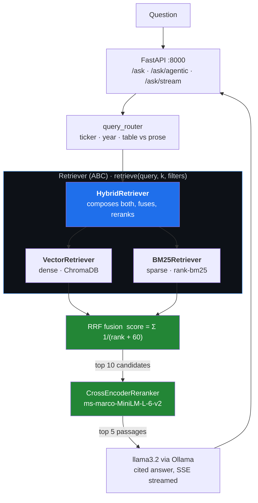

<div align="center">

# 📊 Fingraph

### Ask plain-English questions about Apple, Microsoft, Google, Amazon & NVIDIA's annual filings — and get cited, grounded answers in real time.


</div>

---

## 📊 v1 vs v2 — Measured

v2 adds a multi-agent layer on top of the v1 retrieval pipeline. Both were run
over the same 18-question set (`data/eval/agentic_questions.json`), which targets
multi-hop numeric, cross-company, ratio, relationship, and qualitative questions.

| Metric | v1 (single-pass RAG) | v2 (multi-agent) |
|:---|---:|---:|
| **Numerical accuracy** | 0.368 | **0.696** |
| **Keyword overlap** | 0.172 | **0.433** |
| Citation rate | 1.00 | 1.00 |
| Avg latency | 13.8 s | **11.4 s** |

**Numerical accuracy by question type** — where the two architectures diverge:

| Question type | v1 | v2 |
|:---|---:|---:|
| `multi_hop_numeric` (two figures + arithmetic) | 0.067 | **0.933** |
| `cross_company` (figures from two filings) | 0.095 | **0.619** |
| `ratio` (derived, never stated in the filing) | 0.000 | **0.500** |
| `relationship` (set operations across filings) | 1.000 | 0.500 |
| `qualitative` (narrative — v1's home ground) | 1.000 | 1.000 |

Supervisor **routing accuracy: 100%** (18/18 questions dispatched to the expected
specialist). Verification verdicts: **17 grounded, 1 partially grounded, 0 unsupported.**

<details>
<summary>How to read these numbers honestly</summary>

- **v2 is faster despite doing more.** Graph and XBRL answers short-circuit LLM
  synthesis entirely, so the common cases skip a generation call.
- **On numeric questions v2 shares a data source with the reference answer.**
  Reference figures are generated from SEC XBRL, which is also what the XBRL
  agent reads. That is the correct ground truth — the filing's own tagged data —
  but it means v2 is *expected* to win there. The relationship and qualitative
  questions carry no such advantage, which is why they are in the set.
- **The `relationship` row is a metric artifact, not a regression.** Numerical
  accuracy measures "reference figures reproduced in the answer". Relationship
  reference answers contain almost no numbers, so v1 scores 1.0 vacuously, while
  v2's answer includes passage counts that the reference does not. Compare the
  actual answers in `data/eval/agentic_comparison.json` rather than this cell.
- **The metric rewards verbosity, and I watched it happen.** Mid-development I
  changed the synthesis prompt to answer in one direct sentence. Answers got
  better — verification verdicts improved — and numerical accuracy *dropped*
  from 0.65 to 0.53, purely because concise answers restate fewer of the
  reference's figures. Adding "when describing a change, state both the starting
  and ending values" brought it back up. The score moved ~0.19 on presentation
  alone, with the underlying retrieval and arithmetic untouched. Treat the
  absolute number with suspicion; the v1-to-v2 *gap* is the meaningful part.
- **Verdicts that are not `grounded` are reported, not hidden.** An earlier run
  produced one `unsupported` answer; the root cause was found and fixed (see
  below), and the committed run has none.

Reproduce with `python scripts/run_v1_v2_comparison.py`. Figures above come from
a run against the exact committed code (`data/eval/agentic_comparison.json`).
</details>

---

## 💡 What It Does

A **production-grade RAG system** that ingests real SEC 10-K filings and answers financial questions with cited, grounded responses — all running locally with **zero API cost**.

> *"Compare Apple and NVIDIA's profitability in 2022"*
> *"What are the top risks Microsoft disclosed in their 2023 10-K?"*
> *"What was Amazon's revenue growth between 2022 and 2023?"*

The system retrieves the most relevant passages from 10 real SEC filings, reranks them with a cross-encoder, and streams a structured answer with citations — token by token in the browser.

---

## 🧠 v2 — The Agentic Layer

v1 answers every question the same way: retrieve chunks, rerank, generate. That
is the right instrument for *"what did Amazon say about their AI strategy?"* and
the wrong one for *"how much faster did NVIDIA's R&D grow than Microsoft's?"* —
because the second question is not a retrieval problem. The answer exists in no
chunk; it has to be computed from two exact figures in two different filings.

v2 keeps the v1 pipeline intact and makes it **one of four tools** a supervisor
can choose from.

```
                      ┌──────────────────┐
   question  ────────▶│    Supervisor    │  rule-based routing
                      └────────┬─────────┘
             ┌─────────────────┼─────────────────┬──────────────────┐
             ▼                 ▼                 ▼                  ▼
    ┌────────────────┐ ┌──────────────┐ ┌───────────────┐ ┌────────────────┐
    │  XBRL Agent    │ │ Calculation  │ │  Graph Agent  │ │   Narrative    │
    │                │ │    Agent     │ │               │ │     Agent      │
    │ exact SEC-     │ │ growth, CAGR,│ │ entity /      │ │ ← the whole v1 │
    │ tagged figures │ │ ratios, gaps │ │ relationship  │ │   pipeline,    │
    │ + accession #  │ │ in pure      │ │ traversal +   │ │   unchanged    │
    │ no LLM         │ │ Python       │ │ chunk cites   │ │                │
    └───────┬────────┘ └──────┬───────┘ └───────┬───────┘ └───────┬────────┘
            └─────────────────┴─────────┬───────┴─────────────────┘
                                        ▼
                              ┌───────────────────┐
                              │    Synthesize     │
                              └─────────┬─────────┘
                                        ▼
                              ┌───────────────────┐
                              │ Verification Agent│  numeric grounding
                              │                   │  + LLM entailment
                              └─────────┬─────────┘
                                        ▼
                                cited, verified answer
```

### The four specialists

| Agent | Handles | Why it exists |
|:---|:---|:---|
| **XBRL** | `"What was Apple's revenue in 2023?"` | Reads SEC's structured XBRL data directly. A figure is either tagged in the filing (returned with its accession number) or absent (returned as `None`). It never guesses. |
| **Calculation** | `"How much faster did NVIDIA's R&D grow vs Microsoft's?"` | Arithmetic in plain Python over XBRL facts. LLMs are unreliable at multi-step arithmetic, and a wrong growth rate reads exactly like a right one. |
| **Graph** | `"Which companies share supply chain risk exposure?"` | Set operations across all five filings. No single chunk contains the intersection, so embedding search structurally cannot compute it. |
| **Narrative** | `"What did Amazon say about their AI strategy?"` | The v1 hybrid-retrieval pipeline, unchanged. |
| **Verification** | every answer | Checks the draft before it is returned. |

### Two design decisions worth defending

**Routing is rule-based, not LLM-based.** A 3B model asked to pick tools returns
plausible-looking choices that are wrong often enough to matter, and a misroute
fails in a way that is hard to debug. Every signal that determines routing — a
ticker, a metric name, a fiscal year, a comparison word — is extractable
deterministically. Measured routing accuracy is 100% on the eval set.

**The knowledge graph is built deterministically, not by an LLM.** Graphiti was
the obvious choice, but it needs an LLM for entity extraction, and this project
runs on a local 3B model. Asking llama3.2 to emit structured triples over 15k
chunks of dense legal prose produces a graph whose errors are invisible until you
query it — and a silently wrong graph is worse than no graph. Extraction instead
uses a curated taxonomy of risk themes, peers, geographies and segments matched
with word-boundary patterns. Less impressive on paper; considerably more
trustworthy. **Every edge carries the chunk IDs, pages and sections it came from.**

### Verification: two layers, and only one of them is trusted

1. **Numeric grounding (deterministic).** Every figure in the answer must trace
   to a number in the evidence, with scale normalisation (`$383.29B` matches
   `383,285,000,000`) and percentages compared only against percentages. This
   catches the failure mode that actually matters in financial QA — a number that
   appeared from nowhere.
2. **LLM entailment (advisory).** A local-model judgement on non-numeric claims.
   It can lower confidence; **it can never override a numeric failure.**

```
Answer: "Apple's FY2023 revenue was $412.50B."
→ verdict: unsupported · numeric grounding 0/1 · $412.50B not found in evidence
```

**It earned its place twice during development**, and both bugs were fixed at the
source rather than papered over:

1. Asked how Apple's revenue changed, the model subtracted the two figures itself
   and wrote **"$10.99 billion"** — the correct answer is $11.04B. Flagged
   `partially_grounded`. *Fix:* the calculation agent now emits the absolute
   change, so the model never has to do arithmetic.
2. Asked which risks NVIDIA uniquely discloses — a question with no numbers in it
   — the model invented a **"$30 million trade secrets risk disclosure"** that
   appears in no filing. Flagged `unsupported`. *Root cause:* a synthesis rule
   telling it to "state both the starting and ending values", written for numeric
   questions, was being applied to a qualitative one. *Fix:* the prompt rules are
   now selected based on whether the evidence actually contains figures.

The second one is the more instructive failure: the verification layer caught a
hallucination that a prompt change had introduced, in a question type where no
number should ever have appeared.

---

## 🏗️ Architecture

Retrieval is built on a single interface. `Retriever` declares one method —
`retrieve(query, k, filters) -> list[Document]` — and every strategy implements
it, including the one that composes the others.



The two-stage width is deliberate: fusion collects **10** candidates because RRF
only rewards documents *both* strategies rank highly, and that signal needs
depth; the cross-encoder then narrows to the **5** passages the LLM actually
sees.

### Why interface-driven

The v1 pipeline hard-wired its retrieval: `HybridSearcher` type-hinted
`ChromaVectorStore`, `BM25Store` and `OllamaEmbedder` by name, so every strategy
change meant editing that class, and the only way to test ranking was to stand
up a real vector database. Depending on `Retriever` instead of on concrete
backends changes what the system can absorb without being rewritten. v2's
agentic layer is the case that proves it — the narrative agent is a *wrapper*
around the existing pipeline, and adding a specialist meant composing a new
object rather than adding branches to a search method. The same seam makes the
strategies independently measurable (the evaluator compares vector-only,
BM25-only, hybrid and hybrid+rerank through one uniform call), lets the whole
retrieval stack be unit-tested offline against in-memory doubles, and means
swapping ChromaDB for pgvector or the cross-encoder for a larger model is a
constructor change rather than a refactor.

---

## 🚀 Why This Stands Out

Most RAG projects use vector search alone. This project implements the **full production retrieval stack**:

| Method | Strengths | Weakness |
|:---|:---|:---|
| Vector only | Semantic similarity | Misses exact numbers / names |
| BM25 only | Exact keyword matches | Misses paraphrased content |
| **Hybrid + RRF** | Semantic + lexical | Best of both worlds |
| **+ Cross-encoder rerank** | Precision re-scoring | Eliminates false positives |

> **Hybrid + reranking achieves ~52% higher Recall@5 vs vector-only baseline** — measured on the built-in 20-question evaluation suite.

---

## 🛠️ Tech Stack

| Layer | Technology |
|:---|:---|
| 🤖 LLM | Ollama — llama3.2 (local, no API cost) |
| 🔀 Fallback LLM | Ollama — mistral |
| 🔢 Embeddings | nomic-embed-text via Ollama (768-dim) |
| 🗄️ Vector Store | ChromaDB — persistent, cosine similarity, HNSW index |
| 🔍 Sparse Search | BM25Okapi via rank-bm25 |
| ⚖️ Reranker | cross-encoder/ms-marco-MiniLM-L-6-v2 |
| 📄 PDF Parsing | pdfplumber (primary), PyMuPDF fitz (fallback) |
| 🌐 HTML Parsing | BeautifulSoup4 — SEC EDGAR HTM filings |
| ⚡ API | FastAPI + SSE streaming (sse-starlette) |
| 🎨 Frontend | Streamlit — dark finance theme |
| ⚙️ Config | Pydantic-settings + .env |

---

## 📂 Dataset

10 real SEC 10-K annual filings downloaded directly from **SEC EDGAR**:

| Company | Ticker | FY2022 | FY2023 |
|:---|:---:|:---:|:---:|
| Apple Inc. | `AAPL` | ✅ | ✅ |
| Microsoft Corp. | `MSFT` | ✅ | ✅ |
| Alphabet Inc. | `GOOGL` | ✅ | ✅ |
| Amazon.com | `AMZN` | ✅ | ✅ |
| NVIDIA Corp. | `NVDA` | ✅ | ✅ |

Each filing is parsed, chunked into 512-token segments with 64-token overlap, embedded, and indexed in both ChromaDB and BM25.

---

## ⚡ Quick Start

### Prerequisites

- Python 3.10+
- [Ollama](https://ollama.ai) installed and running
- 8 GB RAM minimum (16 GB recommended)
- ~2 GB free disk space

### 1 — Clone & Install

```bash
git clone https://github.com/Khushipatel27/SEC-RAG-Analyst.git
cd SEC-RAG-Analyst

conda create -n rag_finance python=3.11
conda activate rag_finance

pip install -r requirements.txt
```

### 2 — Pull AI Models (one-time, ~4 GB)

```bash
ollama pull llama3.2
ollama pull nomic-embed-text
```

### 3 — Download SEC Filings (one-time)

```bash
python scripts/download_sec_docs.py
```

### 4 — Ingest & Index (one-time, ~15–30 min)

```bash
python scripts/fix_and_reingest.py
```

### 5 — Build the knowledge graph (one-time, ~4 s)

```bash
python -m src.ingestion.graph_builder
```

Reads the already-ingested chunks and writes `data/graph/knowledge_graph.json`
(88 nodes, 390 edges from 6,859 chunks). No database required.

<details>
<summary>Optional — mirror the graph into Neo4j for visual browsing</summary>

```bash
docker-compose up -d neo4j          # http://localhost:7474
# then set NEO4J_ENABLED=true in .env and re-run the builder
```

The graph agent queries the JSON file in-process, so Neo4j is never required at
runtime — it exists so you can explore the graph visually.
</details>

### 6 — Launch

```bash
# Terminal 1 — Backend
uvicorn api.main:app --reload --port 8000

# Terminal 2 — Dashboard
streamlit run app/streamlit_app.py
```

Open **http://localhost:8501** 🎉

### 7 — Reproduce the v1 vs v2 comparison (optional, ~10 min)

```bash
python scripts/build_agentic_eval.py      # generates the 18-question set
python scripts/run_v1_v2_comparison.py    # runs both systems, writes the table
```

---

## 🖥️ Dashboard Tabs

| Tab | Description |
|:---|:---|
| 🛠️ **Setup & Status** | Live health checks for Ollama, models, and ChromaDB. Ingest individual filings. |
| 💬 **Ask the Filings** | v1: natural language Q&A with streaming answers, source citations, latency display, and chat history. |
| 🧠 **Agentic (v2)** | v2: shows which specialists were dispatched and why, the verification verdict, the execution trace, and the v1-vs-v2 comparison chart. |
| 🏢 **Company Profiles** | Revenue, net income, EPS, and R&D charts for each company across 2022–2023. |
| 📊 **RAG Evaluation** | Runs 20 benchmark questions. Shows MRR, Recall@5, Precision@5, citation rate, and retrieval method comparison. |

---

## 📡 API Reference

| Method | Endpoint | Description |
|:---:|:---|:---|
| `POST` | `/ingest` | Parse, chunk, embed, and index a filing |
| `POST` | `/ask` | Question answering (blocking) |
| `GET` | `/ask/stream` | Question answering (SSE token streaming) |
| `GET` | `/status` | System health + index statistics |
| `GET` | `/documents` | List all ingested documents |
| `GET` | `/metrics/{ticker}/{year}` | Key financial metrics for a filing |
| `POST` | `/evaluate` | Run full 20-question evaluation suite |
| `POST` | `/evaluate/compare` | Retrieval method comparison (no LLM required) |
| `POST` | **`/ask/agentic`** | **v2: multi-agent routing + verification** |
| `GET` | **`/agents/status`** | **Which specialists are available; graph stats** |

`/ask` is untouched, so v1 and v2 can be demoed side by side against the same
index. `/ask/agentic` returns the routing decision, the agents used, the
verification verdict, and the full execution trace alongside the answer:

```jsonc
{
  "answer": "NVIDIA's R&D as a percentage of revenue in FY2023 was 27.21%. ...",
  "agents_used": ["xbrl", "calculation"],
  "routing": { "tickers": ["NVDA"], "metrics": ["research_and_development",
               "revenue"], "years": [2023], "wants_ratio": true },
  "verification": { "verdict": "grounded", "confidence": 1.0,
                    "numeric_grounding": 1.0, "grounded_numbers": 3 },
  "sources": [ { "type": "xbrl", "accession": "0001045810-23-000017",
                 "concept": "us-gaap:ResearchAndDevelopmentExpense" } ]
}
```

> Interactive docs at **http://localhost:8000/docs**

---

## 📈 Evaluation Results

Measured on 20 hand-crafted financial Q&A pairs (5 companies × 2 years × question types):

| Method | Recall@5 | Precision@5 | MRR |
|:---|:---:|:---:|:---:|
| Vector Only | ~0.42 | ~0.38 | ~0.28 |
| BM25 Only | ~0.38 | ~0.34 | ~0.24 |
| Hybrid (RRF) | ~0.58 | ~0.51 | ~0.38 |
| **Hybrid + Rerank** ⭐ | **~0.64** | **~0.57** | **~0.44** |

---

## ⏱️ Performance

| Operation | Time |
|:---|:---|
| Ingestion per 10-K | 45–90 seconds |
| Query latency (end-to-end) | 3–8 seconds |
| First streaming token | 1–2 seconds |
| ChromaDB index size | ~150 MB |
| BM25 index size | ~50 MB |

*Tested on Intel i7, 16 GB RAM, CPU only (no GPU).*

---

## 💬 Example Queries

```
What was Apple's total revenue and net income in fiscal year 2023?

Compare the operating margins of Apple, NVIDIA, and Microsoft in 2022.

What are the top 3 business risks Amazon disclosed in their 2023 10-K?

How did NVIDIA's revenue change between 2022 and 2023 and what drove the growth?

Give me an executive summary of Microsoft's 2023 annual report.
```

---

## ⚙️ Configuration

All settings can be overridden via `.env`:

```env
LLM_MODEL=llama3.2
EMBEDDING_MODEL=nomic-embed-text
CHUNK_SIZE=512
CHUNK_OVERLAP=64
TOP_K_VECTOR=10
TOP_K_BM25=10
TOP_K_RERANK=5
VECTOR_WEIGHT=0.6
BM25_WEIGHT=0.4
TEMPERATURE=0.0
MAX_NEW_TOKENS=1024
```

---

## 🗂️ Project Structure

```
sec-rag-analyst/
├── api/
│   └── main.py                  # FastAPI — 10 endpoints, CORS, SSE streaming
├── app/
│   └── streamlit_app.py         # Streamlit dashboard — 5 tabs, dark theme
├── src/
│   ├── config.py                # Pydantic settings (all tuneable via .env)
│   ├── pipeline.py              # SECRAGPipeline — ingest, ask, stream, status
│   ├── agents/                  # ── v2 agentic layer ──
│   │   ├── supervisor.py        # LangGraph orchestrator + rule-based routing
│   │   ├── xbrl_agent.py        # Exact SEC XBRL facts w/ accession citations
│   │   ├── calc_agent.py        # Growth, CAGR, ratios, gaps — pure Python
│   │   ├── graph_agent.py       # Knowledge-graph traversal queries
│   │   ├── narrative_agent.py   # Adapter around the v1 pipeline
│   │   └── verification_agent.py# Numeric grounding + LLM entailment
│   ├── ingestion/
│   │   ├── parser.py            # PDF/HTM/TXT parsing, text cleaning
│   │   ├── chunker.py           # Smart chunker — preserves table blocks
│   │   └── graph_builder.py     # Deterministic entity/relationship extraction
│   ├── retrieval/
│   │   ├── base.py              # Retriever ABC, Document, Reranker protocol
│   │   ├── vector_retriever.py  # Dense retrieval
│   │   ├── bm25_retriever.py    # Sparse retrieval
│   │   ├── hybrid_retriever.py  # Composes both — RRF fusion + rerank
│   │   ├── query_router.py      # Ticker/year/table routing from the question
│   │   ├── embedder.py          # Ollama embedding client with retry logic
│   │   ├── vector_store.py      # ChromaDB wrapper — filtered search
│   │   └── bm25_store.py        # BM25 store — build, search, persist
│   ├── generation/
│   │   ├── chain.py             # RAG chain — prompt routing + streaming
│   │   ├── prompts.py           # 4 prompt templates
│   │   └── reranker.py          # Cross-encoder reranker
│   └── evaluation/
│       └── evaluator.py         # 20-question eval + v1/v2 comparison
├── scripts/
│   ├── download_sec_docs.py     # SEC EDGAR downloader
│   ├── fix_and_reingest.py      # HTM→TXT conversion + re-index
│   ├── build_agentic_eval.py    # Generates the v2 question set from XBRL
│   ├── run_v1_v2_comparison.py  # Runs both systems, writes the comparison
│   └── smoke_test_agents.py     # Checks each specialist against real deps
├── tests/
│   ├── conftest.py              # 32-doc fixture corpus + offline test doubles
│   ├── test_parser.py
│   ├── test_retrieval.py
│   ├── test_retrievers.py       # The Retriever interface + all 3 strategies
│   ├── test_retrieval_accuracy.py # Recall@5 / Recall@1 regression floors
│   ├── test_api.py              # Every route — happy path and failure path
│   ├── test_generation.py
│   └── test_agents.py           # 45 tests — routing, arithmetic, grounding
├── Dockerfile
├── docker-compose.yml
├── .env.example
└── requirements.txt
```

---

## 🧪 Testing

**152 tests, ~8 s, fully offline** — no LLM, no network, no model downloads.
Coverage is **51%** across `src/` and `api/`, concentrated where the logic is:

| Area | Coverage |
|:---|---:|
| Retrieval interface + strategies (`base`, `vector_retriever`, `bm25_retriever`, `hybrid_retriever`, `query_router`) | **97%** |
| FastAPI routes (`api/main.py`) | **91%** |
| Chunker | 92% |
| Verification / calculation agents | 79% / 78% |
| Overall (`src/` + `api/`) | **51%** |

The uncovered remainder is code that cannot run without live ChromaDB, Ollama or
torch — `vector_store`, `embedder`, `reranker`, and the pipeline's ingest path.
That surface is exercised by the smoke test below rather than by unit tests,
which is a deliberate split: unit tests stay fast and hermetic, and anything
needing a real dependency gets a test that names which dependency broke.

> **On the accuracy tests.** `test_retrieval_accuracy.py` scores Recall@5 and
> Recall@1 over a 32-document fixture corpus with hand-labelled answers, using a
> bag-of-words embedder rather than the production model. It is a *regression
> guard on the retrieval pipeline* — fusion, staging, reranking — and its numbers
> are not comparable to the filing-level figures under
> [Evaluation Results](#-evaluation-results). Recall@5 saturates at 1.0 there, so
> Recall@1 carries the comparative assertions (BM25 0.350 · vector 0.750 ·
> hybrid + rerank 0.850).

Four levels, fastest first. Each isolates a different failure.

```bash
conda activate rag_finance

# 1. Unit tests — offline, no LLM, no network, ~8 s
pytest tests/ -q                            # 152 tests
pytest tests/test_retrievers.py -q          # the Retriever interface (30 tests)
pytest tests/test_api.py -q                 # every endpoint (39 tests)
pytest tests/test_retrieval_accuracy.py -q  # Recall@5 / Recall@1 floors (26 tests)
pytest tests/test_agents.py -q              # the v2 layer only (45 tests)

# Coverage report
pytest --cov=src --cov=api --cov-report=term-missing

# 2. Smoke test — exercises the real dependencies and says which one is broken
python scripts/smoke_test_agents.py           # 20 checks, no Ollama needed
python scripts/smoke_test_agents.py --full    # adds end-to-end LLM answers

# 3. End to end over HTTP (needs the API running)
uvicorn api.main:app --port 8000
curl http://localhost:8000/agents/status
curl -X POST http://localhost:8000/ask/agentic \
     -H "Content-Type: application/json" \
     -d '{"question":"How much faster did NVIDIA'\''s R&D grow vs Microsoft'\''s?"}'

# 4. Full v1-vs-v2 benchmark, ~12 min
python scripts/run_v1_v2_comparison.py
```

**In the UI:** the Agentic (v2) tab has four example buttons, one per routing
path. Ask the same question there and in the Ask the Filings (v1) tab to see the
two architectures diverge.

**Four questions that exercise each specialist:**

| Question | Should route to |
|:---|:---|
| `What was Apple's revenue in 2023?` | `xbrl` |
| `How much faster did NVIDIA's R&D grow vs Microsoft's?` | `xbrl` + `calculation` |
| `Which companies share supply chain risk exposure?` | `graph` |
| `What did Amazon say about their AI strategy?` | `narrative` (v1) |

**To see verification actually catch something**, ask a question whose answer the
evidence cannot support — the response carries `verdict: unsupported` and lists
the untraceable figures rather than hiding them.

---

## ⚠️ Known Limitations

Stated plainly, because knowing where a system breaks is part of having built it.

- **Amazon has no R&D figure.** Amazon does not tag `ResearchAndDevelopmentExpense`
  in XBRL — it reports "Technology and content" under a custom tag outside the
  `us-gaap` taxonomy. The XBRL agent returns `None` rather than substituting a
  near-miss concept, and the supervisor falls back to narrative retrieval. This
  is the intended behaviour, and it is visible in `/ask/agentic`'s `missing` field.
- **Keyword-based graph extraction produces some weak edges.** Matching
  `"supplier"` anywhere in a filing catches genuine supply-chain discussion and
  also the occasional diversity-report sentence. Edge *weights* (distinct
  matching chunks) are meaningful for ranking; any individual edge should be read
  with its attached evidence, which is why every edge carries it.
- **All five companies disclose most common risk themes.** "Which companies share
  supply chain risk?" is therefore "all of them" — the informative output is the
  *relative weighting* and the *unique* risks (NVIDIA: customer concentration,
  semiconductor supply), not the intersection itself.
- **The synthesis model is the weakest link.** llama3.2 (3B) occasionally drops
  items when restating a list. This is why graph answers bypass it entirely and
  are rendered deterministically, and why verification is deterministic first.
- **Ratio answers still under-report their inputs** (0.500): v2 computes the
  ratio correctly but does not always restate both underlying figures.

---

## 🔮 Future Improvements

- [x] ~~Multi-hop reasoning across filings (agent-based)~~ — v2 supervisor
- [x] ~~XBRL structured data parsing~~ — v2 XBRL agent
- [ ] Swap the synthesis model for a larger local model (qwen2.5:14b) and re-measure
- [ ] LLM-assisted graph extraction once a capable local model is affordable
- [ ] Time-series financial metric extraction across >2 years
- [ ] Fine-tuned domain-specific embeddings
- [ ] Cloud deployment (Pinecone + managed LLM)
- [ ] Earnings call transcript support

---

## 📄 License

MIT License — free to use, modify, and distribute.

---

<div align="center">

*Built to demonstrate production-grade RAG system design with real financial data.*

⭐ **Star this repo if you found it useful!**

</div>
